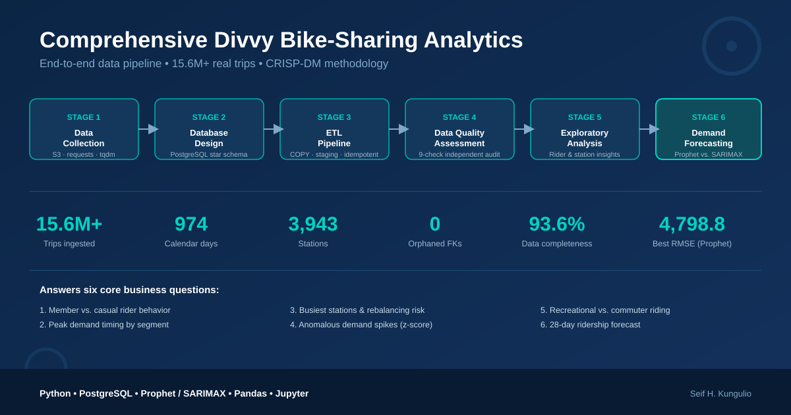

[]()

# Comprehensive Divvy Bike-Sharing Analytics

**An end-to-end data science pipeline — from raw public data to a production-style demand forecast — built on 15.6M+ real Divvy bike-share trips using the CRISP-DM methodology.**

[](https://www.python.org/)
[](https://www.postgresql.org/)
[](https://facebook.github.io/prophet/)
[](https://jupyter.org/)

---

## Project Overview

This project builds a complete analytics pipeline for [Divvy](https://divvybikes.com/), Chicago's public bike-share system, covering every stage from raw data ingestion to a validated demand forecast. It is designed to demonstrate production-grade data engineering and data science skills — not just a one-off notebook analysis.

The pipeline collects, cleans, models, and analyzes **15.6+ million individual bike trips** spanning **January 2024 – August 2026**, stores them in a properly normalized PostgreSQL warehouse, audits their quality independently of the ETL process, extracts business insights, and forecasts future ridership using statistically validated time-series models.

**Why this project matters for recruiters:** it shows the full data science lifecycle — data acquisition, database design, ETL engineering, data quality auditing, exploratory analysis, and forecasting/model evaluation — applied to a realistic, messy, large-scale public dataset, using the same CRISP-DM framework used in industry.

---

## Business Understanding

Divvy operates thousands of bikes across hundreds of docking stations in Chicago, serving two distinct customer segments: **annual members** (subscription riders) and **casual riders** (single-ride/day-pass users). Understanding how these segments behave — and predicting how demand will change — directly informs decisions about pricing, marketing, bike/dock inventory, and rebalancing logistics.

This project answers six core business questions:

1. How do **member and casual riders** differ in ride behavior?
2. When does **ridership peak**, and how does that differ by rider type?
3. Which **stations** are busiest, and where do bikes accumulate or run out (rebalancing risk)?
4. Are there **anomalous demand spikes or drops** worth investigating operationally?
5. How much **round-trip (recreational) vs. point-to-point (commuter) riding** occurs, and for whom?
6. What will **ridership look like over the next 28 days**, system-wide and by rider segment?

---

## Repository Structure

```
comprehensive_divvy_bike_sharing_analytics/
├── 01_data_collection.ipynb          # Automated download & consolidation of raw Divvy data
├── 02_database_design.ipynb          # PostgreSQL star-schema design (DDL, constraints, views)
├── 03_etl_pipeline.ipynb             # Cleaning, transformation, and idempotent warehouse loading
├── 04_data_quality_assessment.ipynb  # Independent 9-check data quality audit + scorecard
├── 05_exploratory_analysis.ipynb     # Business-question-driven exploratory analysis
├── 06_demand_forecasting.ipynb       # Time-series demand forecasting (Prophet vs. SARIMAX)
├── reports/                          # Generated markdown/JSON/CSV reports and charts
└── README.md
```

Each notebook corresponds to one stage of the CRISP-DM process and can be run independently once its upstream dependencies have been executed.

---

## The Pipeline (CRISP-DM Stages)

### 1. Data Collection — `01_data_collection.ipynb`
Automatically discovers and downloads Divvy's publicly hosted monthly trip-data ZIP files (`divvy-tripdata.s3.amazonaws.com`) — no credentials required. The pipeline is **config-driven** (start year/month) and **idempotent**: it detects already-downloaded and already-extracted files and skips them, making re-runs safe and fast. Out of 96 available archives, 32 relevant monthly files were identified, downloaded, extracted, and consolidated into a unified `csv_master/` directory.

**Tech:** `requests`, `BeautifulSoup`, `tqdm`, `zipfile`, `shutil`

### 2. Database Design — `02_database_design.ipynb`
Designs a **PostgreSQL star schema** (`divvy_db.divvy`) purpose-built for analytical querying: four dimension tables (`dim_date`, `dim_station`, `dim_ride_type`, `dim_member_type`) and one fact table (`fact_trip`), enforced with foreign keys and `CHECK` constraints (e.g., positive duration, `started_at < ended_at`). Includes seven performance indexes and two analytical views — `vw_daily_rides` and `vw_station_flow` (net bike inflow/outflow per station, a direct signal for rebalancing operations). DDL execution is transactional and idempotent, and credentials are kept out of source control via an external config file.

**Tech:** PostgreSQL, `psycopg2`, transactional DDL

### 3. ETL Pipeline — `03_etl_pipeline.ipynb`
Cleans and loads all 32 monthly CSVs into the warehouse with defensive, production-style logic: drops rows with missing/duplicate `ride_id`s, parses timestamps, computes ride duration, and **flags rather than silently drops** anomalies (out-of-bounds coordinates, sub-60-second or 24-hour+ trips) via an `is_anomalous` column so downstream analysis can decide how to treat them. Dimension tables are resolved via mode/median station logic, and fact rows are bulk-loaded using PostgreSQL `COPY` through a staging table with `ON CONFLICT (ride_id) DO NOTHING` for guaranteed idempotency. Each file loads in its own transaction with rollback isolation, so one bad file can't corrupt the run.

**Results:** 32/32 files processed successfully · 15,671,584 rows ingested → 15,670,541 rows after cleaning · 0 load failures · re-running the pipeline reloads 0 duplicate rows, confirming idempotency.

**Post-load validation:** 974 calendar days · 3,943 stations · 3 ride types · 2 member types · 15,670,295 fact rows · **0 orphaned foreign keys** · data spans Jan 1, 2024 – Aug 31, 2026.

### 4. Data Quality Assessment — `04_data_quality_assessment.ipynb`
An **independent audit** that re-derives quality metrics directly from the warehouse rather than trusting the ETL's self-reported counts — a best practice for catching silent pipeline bugs. Runs 9 checks across an 8-million-row sample: duplicate IDs, missing stations, invalid timestamps, negative durations, impossible coordinates, null rates, cardinality, completeness, and consistency.

**Key results:**
| Check | Result |
|---|---|
| Duplicate `ride_id`s | 0 |
| Invalid timestamps | 0 |
| Impossible coordinates | 0 |
| Missing calendar days | 0 |
| Duration mismatches | 171 (minor) |
| NULL station keys | ~19% (legitimate missing source data, not FK errors) |
| Overall completeness | 93.64% |

A composite **0–100 Data Quality Score** is computed across five weighted dimensions (Uniqueness 20%, Completeness 20%, Validity 25%, Consistency 20%, Accuracy 15%) and rendered with a letter grade, alongside exported markdown/JSON/CSV reports and charts.

### 5. Exploratory Analysis — `05_exploratory_analysis.ipynb`
Directly answers the project's business questions using the full, validated dataset (15,670,295 trips; 2.58% flagged anomalous; 31.45% missing station detail). See [Key Business Questions & Findings](#-key-business-questions--findings) below for results.

### 6. Demand Forecasting — `06_demand_forecasting.ipynb`
Builds a daily ridership time series (974 days) and rigorously tests it before modeling: an Augmented Dickey-Fuller test confirms non-stationarity (p = 0.44), justifying differencing, while seasonal decomposition and ACF/PACF analysis confirm strong **weekly seasonality**. Four candidate models are benchmarked on a 28-day holdout:

| Model | MAE | RMSE | MAPE |
|---|---|---|---|
| Naive | 3,874.9 | 5,140.4 | 15.98% |
| Seasonal Naive | 5,908.3 | 8,037.5 | 22.66% |
| SARIMAX(1,1,1)(1,1,1,7) | 3,412.4 | 4,799.6 | 14.93% |
| **Prophet (selected)** | 3,887.4 | **4,798.8** | 15.28% |

Prophet was selected as the production model — effectively tied with SARIMAX on RMSE, while offering simpler maintenance, built-in seasonality handling, and native uncertainty intervals. The final model produces a **28-day forward forecast** (from Sept 1, 2026) both system-wide and by rider segment — e.g., Sept 1 is forecast at ~27,963 total rides (80% CI: 23,627–32,059), split ~18,062 member / ~9,865 casual.

---

## Key Business Questions & Findings

### 1. How do member and casual riders differ?
Members dominate volume (**64.1%** of rides, 9.78M trips) with short, efficient trips — averaging **12.3 minutes** and rarely on weekends (23.8%), consistent with weekday commuting. Casual riders (35.9%, 5.49M trips) take much longer trips — averaging **20.2 minutes**, nearly double the median — and ride on weekends far more often (37.6%), consistent with leisure use. Casual riders are also **3.5x more likely** to make a round trip (5.72% vs. 1.61%).

### 2. When does demand peak, and for whom?
Member ridership peaks sharply during weekday commute hours (morning and evening rush), while casual ridership peaks on weekend afternoons — two distinct usage patterns that should inform differentiated marketing and rebalancing schedules by day-of-week.

### 3. Which stations are busiest, and where does bike rebalancing matter most?
**Navy Pier** is the single busiest station (203K+ activities), followed by Streeter Dr & Grand Ave and DuSable Lake Shore Dr locations. Using net station inflow/outflow as a rebalancing signal: **Streeter Dr & Grand Ave** accumulates excess bikes (net −1,602), while **DuSable Lake Shore Dr & Monroe St** (+2,170) and **DuSable Lake Shore Dr & North Blvd** (−2,291 net) show the opposite pattern — actionable signals for operational bike redistribution.

### 4. Are there anomalous demand spikes worth investigating?
Z-score analysis against a 28-day rolling baseline flagged several statistically unusual days — e.g., a casual-rider demand spike on March 21, 2026 (z = 4.14) — suggesting event-driven or weather-driven demand shocks worth cross-referencing with external calendars.

### 5. How much riding is recreational (round-trip) vs. point-to-point?
Round-trip behavior is highest among **casual riders on classic bikes** — 11.0% on weekends and 9.8% on weekdays — confirming recreational, leisure-oriented usage. It's lowest among **members on electric bikes on weekdays** (0.87%), confirming efficient, point-to-point commuting.

### 6. What does near-term demand look like?
The Prophet model forecasts system-wide daily ridership 28 days ahead with segment-level breakdowns (member vs. casual), giving operations and marketing teams a statistically grounded basis for staffing, bike allocation, and campaign timing decisions.

---

## Technologies Used

| Category | Tools |
|---|---|
| Languages | Python, SQL |
| Data Engineering | Pandas, NumPy, psycopg2, PostgreSQL (`COPY`, staging tables) |
| Data Collection | requests, BeautifulSoup, tqdm |
| Time-Series Modeling | Prophet, statsmodels (SARIMAX, ADF test, seasonal decomposition) |
| Visualization | Matplotlib, Seaborn |
| Environment | Jupyter Notebook, Python virtual environments, Git |

---

## How to Run

1. Clone the repository and create a virtual environment:
   ```bash
   python -m venv venv
   source venv/bin/activate  # Windows: venv\Scripts\activate
   pip install -r requirements.txt
   ```
2. Configure database credentials in an external `config.py` / `database.ini` (never commit real credentials).
3. Run the notebooks in order — each stage depends on artifacts/tables created by the previous one:
   ```
   01_data_collection.ipynb → 02_database_design.ipynb → 03_etl_pipeline.ipynb
   → 04_data_quality_assessment.ipynb → 05_exploratory_analysis.ipynb → 06_demand_forecasting.ipynb
   ```
4. Generated reports and charts are written to `reports/`.

---

## Future Improvements

- Deploy the Prophet forecasting model as a scheduled batch job with automated retraining and drift monitoring.
- Incorporate external features (weather, local events, holidays) to improve forecast accuracy and explain anomaly spikes.
- Build a live dashboard (Power BI / Streamlit) on top of `vw_daily_rides` and `vw_station_flow` for operational rebalancing decisions.
- Extend station-level analysis into a full rebalancing optimization/routing model.
- Add automated data quality monitoring (e.g., Great Expectations) directly into the ETL pipeline.

---

## Author

**Seif H. Kungulio**

M.S. Data Analytics,

Maryville University of Saint Louis

---

## Data Source

Trip data provided by [Divvy Bikes](https://divvybikes.com/system-data) under Chicago's Divvy Bicycle Sharing Data License Agreement. This project uses publicly available, anonymized trip records; no personally identifiable information is included.
