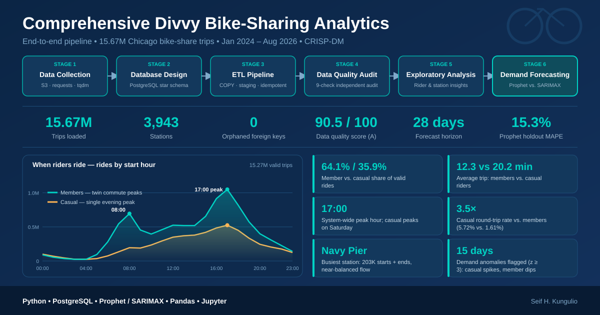

[]()

# Comprehensive Divvy Bike-Sharing Analytics

**An end-to-end data science pipeline — from raw public data to a 28-day demand forecast — built on 15.6M+ real Divvy bike-share trips using the CRISP-DM methodology.**

[](https://www.python.org/)
[](https://www.postgresql.org/)
[](https://facebook.github.io/prophet/)
[](https://jupyter.org/)

---

## Project Overview

This project builds a complete analytics pipeline for [Divvy](https://divvybikes.com/), Chicago's public bike-share system, covering every stage from raw data ingestion to a validated demand forecast. It is designed to demonstrate production-grade data engineering and data science skills — not just a one-off notebook analysis.

The pipeline collects, cleans, models, and analyzes **15.67 million individual bike trips** spanning **January 1, 2024 – August 31, 2026**, stores them in a normalized PostgreSQL star schema, audits their quality independently of the ETL process, extracts business insights from the **15.27M valid trips** that remain after flagged anomalies are excluded, and forecasts future ridership using statistically validated time-series models.

**Why this project matters for recruiters:** it shows the full data science lifecycle — data acquisition, database design, ETL engineering, data quality auditing, exploratory analysis, and forecasting/model evaluation — applied to a realistic, messy, large-scale public dataset, using the same CRISP-DM framework used in industry. It also reports its own limitations honestly (see [Known Limitations](#known-limitations)).

---

## Business Understanding

Divvy operates thousands of bikes across hundreds of docking stations in Chicago, serving two distinct customer segments: **annual members** (subscription riders) and **casual riders** (single-ride/day-pass users). Understanding how these segments behave — and predicting how demand will change — directly informs decisions about pricing, marketing, bike/dock inventory, and rebalancing logistics.

This project answers six core business questions:

1. How do **member and casual riders** differ in ride behavior?
2. When does **ridership peak**, and how does that differ by rider type?
3. Which **stations** are busiest, and where do bikes accumulate or run out (rebalancing risk)?
4. Are there **anomalous demand spikes or drops** worth investigating operationally?
5. How much **round-trip (recreational) vs. point-to-point (commuter) riding** occurs, and for whom?
6. What will **ridership look like over the next 28 days**, system-wide and by rider segment?

---

## Repository Structure

```
comprehensive_divvy_bike_sharing_analytics/
├── notebooks/
│   ├── 01_data_collection.ipynb          # Automated download & consolidation of raw Divvy data
│   ├── 02_database_design.ipynb          # PostgreSQL star-schema design (DDL, constraints, indexes, views)
│   ├── 03_etl_pipeline.ipynb             # Cleaning, transformation, idempotent warehouse loading, validation
│   ├── 04_data_quality_assessment.ipynb  # Independent 9-check data quality audit + weighted scorecard
│   ├── 05_exploratory_analysis.ipynb     # Business-question-driven exploratory analysis
│   └── 06_demand_forecasting.ipynb       # Time-series demand forecasting (Prophet vs. SARIMAX)
├── data/                                 # Generated locally: raw ZIPs, extracted CSVs, ingestion manifest
├── reports/
│   ├── etl_reports/                      # Per-file ETL quality report (CSV) + pipeline log
│   ├── data_quality_reports/             # Markdown / JSON / CSV audit reports + charts
│   ├── exploratory_analysis_reports/     # Result tables (CSV) + 5 figures
│   └── demand_forecasting_reports/       # Markdown / JSON / CSV forecast reports + charts
├── src/                                  # README banner
└── README.md
```

Each notebook corresponds to one stage of the CRISP-DM process and can be run independently once its upstream dependencies have been executed.

---

## The Pipeline (CRISP-DM Stages)

### 1. Data Collection — `01_data_collection.ipynb`
Automatically discovers and downloads Divvy's publicly hosted monthly trip-data ZIP files by parsing the XML index of the public `divvy-tripdata` S3 bucket — no credentials required. The pipeline is **config-driven** (start year/month) and **idempotent**: downloads are streamed in 1 MB chunks (memory-safe), and already-downloaded and already-extracted files are skipped, making re-runs safe and fast. Out of 96 objects in the bucket, 32 monthly files (Jan 2024 – Aug 2026) were selected, downloaded, extracted into per-month folders, and consolidated into a flat `csv_master/` directory (macOS `._` resource-fork files are filtered out).

**Tech:** `requests`, `BeautifulSoup`, `tqdm`, `zipfile`, `shutil`

### 2. Database Design — `02_database_design.ipynb`
Designs a **PostgreSQL star schema** (`divvy_db.divvy`) purpose-built for analytical querying: four dimension tables (`dim_date`, `dim_station`, `dim_ride_type`, `dim_member_type`) and one fact table (`fact_trip`) with six foreign keys, a `UNIQUE` `ride_id`, and database-level `CHECK` constraints (`duration_minutes > 0`, `started_at < ended_at`). The fact table stores engineered fields (`duration_minutes`, `start_hour`, `day_of_week`, `month_partition`) and two quality flags (`is_round_trip`, `is_anomalous`) so suspect rows can be flagged rather than deleted. Seven indexes target the foreign keys and month filter, and two analytical views — `vw_daily_rides` (rides and average duration by day × member type) and `vw_station_flow` (daily rides started vs. ended per station; `net_outflow = started − ended`, a direct rebalancing signal) — make the warehouse BI-ready. DDL runs in a single transaction and is idempotent; the database-creation step never drops existing data; credentials are kept out of source control via an external config file.

**Tech:** PostgreSQL, `psycopg2`, transactional DDL, PL/pgSQL

### 3. ETL Pipeline — `03_etl_pipeline.ipynb`
Cleans and loads all 32 monthly CSVs into the warehouse with defensive, production-style logic. Each file is loaded with explicit string dtypes and schema validation, then cleaned (whitespace trimming, missing/duplicate `ride_id` removal, timestamp parsing, duration computed and rounded *before* the positivity filter so rounding can't violate the DB constraint). Anomalies are **flagged rather than silently dropped** via `is_anomalous`: trips under 60 seconds, trips over 24 hours, and coordinates outside a Chicagoland bounding box. Station dimension rows are resolved with the **mode** of the station name and the **median** of its coordinates; fact rows are bulk-loaded with PostgreSQL `COPY` through a temporary staging table and merged with `ON CONFLICT (ride_id) DO NOTHING`. Each file loads in its own transaction, so one bad file can't corrupt the run, and every file contributes a row to a structured data-quality report and log.

After loading, a **verify-then-delete cleanup** step removes the intermediate `downloads/` and `csv_master/` folders (~3.6 GB freed) only if every file loaded, there are zero orphaned keys, and every month is confirmed present in `fact_trip`. It supports a `DRY_RUN` mode, refuses to delete anything outside `data/`, and records ingested months in `data/ingested_files.txt`.

**Results:**

| Metric | Value |
|---|---|
| Files processed | 32 / 32 (0 failures) |
| Raw rows in | 15,671,584 |
| Rows after cleaning | 15,670,541 (1,043 dropped — all non-positive duration after rounding; no missing/duplicate IDs or unparseable timestamps) |
| Rows loaded into `fact_trip` | 15,670,295 (246 further rows skipped by `ON CONFLICT` because their `ride_id` was already loaded) |
| Rows flagged `is_anomalous` | 404,155 (2.58%): 387,258 trips < 60 s · 16,811 trips > 24 h · 86 out-of-bounds coordinates |

**Post-load validation** (re-queried from the warehouse): 974 calendar days · 3,943 stations · 3 ride types · 2 member types · 15,670,295 fact rows · **0 orphaned foreign keys** · data spans Jan 1, 2024 – Aug 31, 2026.

**Tech:** `pandas`, `NumPy`, `psycopg2` (`execute_values`, `COPY`), `logging`

### 4. Data Quality Assessment — `04_data_quality_assessment.ipynb`
An **independent audit** that re-derives quality metrics directly from the warehouse rather than trusting the ETL's self-reported counts — a best practice for catching silent pipeline bugs. It runs 9 checks over the **full 15.67M-row fact table**: duplicate IDs, missing stations, invalid timestamps, negative durations (including a recomputed-vs-stored duration cross-check), impossible coordinates, null rates, cardinality, completeness, and consistency. Each check receives a PASS/WARN/FAIL verdict from explicit thresholds (≥ 1% of rows affected = FAIL).

**Key results:**

| Check | Result |
|---|---|
| Duplicate `ride_id`s | 0 — PASS |
| Invalid timestamps | 0 — PASS |
| Non-positive durations | 0 — PASS |
| Duration mismatches (stored vs. recomputed, > 0.5 min) | 314 (0.002%) — PASS |
| Impossible coordinates (incl. (0, 0)) | 0 — PASS |
| Orphaned foreign keys (stations, dates, ride/member types) | 0 |
| Missing calendar days / zero-ride days | 0 of 974 |
| NULL station keys | 20.0% start · 20.9% end · 31.4% of trips missing at least one — FAIL (missing in the source exports, not FK errors) |
| Overall completeness (6 critical columns) | 93.19% |
| Derived-field consistency (`day_of_week`, `start_date_key`, `month_partition`) | 38.7% of rows flagged — FAIL (see [Known Limitations](#known-limitations)) |

A composite **0–100 Data Quality Score** is computed across five weighted dimensions and rendered with a letter grade: **90.51 / 100 (Grade A)**.

| Dimension | Weight | Score |
|---|---|---|
| Uniqueness | 20% | 100.00 |
| Completeness | 20% | 93.19 |
| Validity | 25% | 100.00 |
| Consistency | 20% | 61.31 |
| Accuracy | 15% | 97.42 |

Findings are exported as Markdown, JSON, and CSV reports plus missing-value charts (table × column heatmap and row-level presence matrix).

### 5. Exploratory Analysis — `05_exploratory_analysis.ipynb`
Directly answers the project's business questions with SQL aggregations in PostgreSQL and Python visualizations. The analysis population is **15,266,190 valid trips**: positive duration and not flagged `is_anomalous` (2.58% of the 15,670,295 loaded trips are excluded). 31.45% of loaded trips lack a start or end station, so they stay in system-wide measures, but station-level metrics only include records with the relevant station key. See [Key Business Questions & Findings](#key-business-questions--findings) below.

### 6. Demand Forecasting — `06_demand_forecasting.ipynb`
Builds a gap-filled daily ridership series (974 days; mean 15,674 rides/day, range 429 – 39,342) from the same valid-trip population and rigorously tests it before modeling: an Augmented Dickey-Fuller test confirms non-stationarity (statistic −1.675, p = 0.44), justifying differencing, while seasonal decomposition and ACF/PACF analysis support a **7-day seasonal cycle**. Four candidate models are benchmarked on a 28-day holdout (train: Jan 1, 2024 – Aug 3, 2026; test: Aug 4 – Aug 31, 2026):

| Model | MAE | RMSE | MAPE |
|---|---|---|---|
| Naive (last value) | 3,874.9 | 5,140.4 | 15.98% |
| Seasonal naive (last week) | 5,908.3 | 8,037.5 | 22.66% |
| SARIMAX(1,1,1)(1,1,1,7) | **3,412.4** | 4,799.6 | **14.93%** |
| **Prophet (selected)** | 3,873.0 | **4,790.5** | 15.25% |

Models are ranked by RMSE, so Prophet (weekly + yearly seasonality, 80% interval) is selected for the production forecast. The margin over SARIMAX is tiny (~0.2% on RMSE) and SARIMAX is actually better on MAE and MAPE, so the two are effectively tied; Prophet's built-in uncertainty intervals and seasonality handling make it a convenient choice. Both models beat the naive baseline only modestly (Prophet cuts RMSE by ~7%; SARIMAX cuts MAE by ~12%).

The selected model is refit on the full history to produce a **28-day forward forecast** (Sept 1 – Sept 28, 2026) system-wide and by rider segment — e.g., Sept 1 is forecast at ~27,955 total rides (80% interval: 23,853 – 32,102), split ~18,054 member / ~9,862 casual. Segment forecasts are point estimates; forecasts, like the history they're trained on, exclude flagged anomalous trips.

---

## Key Business Questions & Findings

### 1. How do member and casual riders differ?
Members dominate volume (**64.1%** of valid rides, 9.78M trips) with short, efficient trips — averaging **12.3 minutes** (median 8.8) and riding on weekends only 23.8% of the time, consistent with weekday commuting. Casual riders (35.9%, 5.49M trips) take much longer trips — averaging **20.2 minutes** (median 12.0, 95th percentile 60.0 vs. 31.4 for members) — and ride on weekends far more often (37.6%), consistent with leisure use. The gap between casual riders' mean and median signals a long tail of very long rides. Casual riders are also **3.5x more likely** to make a round trip (5.72% vs. 1.61%).

### 2. When does demand peak, and for whom?
System-wide demand peaks at **17:00**, and the busiest month in the data is **August 2026**. Members show twin commute peaks (around 08:00 and 17:00) and ride most Tuesday–Thursday, tapering over the weekend. Casual ridership builds through the day to a single evening peak and is highest on **Saturday** (roughly 1.9x its Tuesday volume), with its longest trips on weekends. Seasonality is strong for both segments, but casual demand swings far more — falling by more than 10x between summer and winter versus roughly 4x for members — and summer 2026 months are running above 2025. Electric bikes account for 60.6% of valid rides, classic bikes 38.5%, and scooters 0.9%; casual classic-bike rides are by far the longest (25.2 min avg vs. 12.2 on e-bikes). These patterns suggest differentiated marketing and rebalancing schedules by day-of-week and season.

### 3. Which stations are busiest, and where does bike rebalancing matter most?
By total activity (starts + ends), **Navy Pier** is the busiest station (203K activities), followed by **Streeter Dr & Grand Ave** (154K), **DuSable Lake Shore Dr & Monroe St** (113K), **Michigan Ave & Oak St** (106K), and **DuSable Lake Shore Dr & North Blvd** (105K). Using net outflow (rides started − rides ended) as a rebalancing signal — positive means bikes drain away and the station risks running empty, negative means bikes pile up:

- **Largest net outflow:** Buckingham Fountain (+3,347); among the busiest stations, DuSable Lake Shore Dr & Monroe St (+2,170).
- **Largest net inflow:** DuSable Lake Shore Dr & North Blvd (−4,060 under one station ID, −2,291 under another); among the busiest, Streeter Dr & Grand Ave (−1,602).
- **Navy Pier is almost perfectly balanced** (+251 on 203K activities) despite its volume.

These are actionable signals for operational bike redistribution — a rebalancing signal, not a station-quality score.

### 4. Are there anomalous demand spikes worth investigating?
Comparing each rider segment's daily rides to its own trailing 28-day baseline (z-score ≥ 3) flagged **15 unusual days**. Twelve are **casual-rider spikes, all between February and May** — e.g., March 21, 2026 (10,441 rides vs. a ~2,300 baseline, z = 4.14), March 14, 2025 (z = 4.12), and April 13, 2024 (z = 3.92) — and three are **member-rider dips, all on Sundays** (Oct 19, 2025; Sep 22, 2024; Jun 21, 2026). These look like weather- or event-driven demand shocks worth cross-referencing with external calendars; because the baseline is a trailing average, early-season spikes also partly reflect the seasonal ramp-up from low winter volume.

### 5. How much riding is recreational (round-trip) vs. point-to-point?
Round-trip behavior is highest among **casual riders on classic bikes** — 11.0% on weekends and 9.8% on weekdays (averaging 46–48 minutes) — confirming recreational, leisure-oriented usage. It is lowest among **members on electric bikes on weekdays** (0.87%), confirming efficient, point-to-point commuting. Because round trips can only be detected when both stations are recorded, and these rates are calculated over all valid rides, they are conservative lower bounds.

### 6. What does near-term demand look like?
The Prophet model forecasts system-wide daily ridership 28 days ahead (roughly 27,000–30,000 rides per day in early September, with an 80% interval of about ±4,000) with member and casual breakdowns, giving operations and marketing teams a statistically grounded starting point for staffing, bike allocation, and campaign timing decisions. Expect real days to be noisier than the forecast line: the model's holdout MAPE is ~15%.

---

## Known Limitations

- **Consistency score is likely understated.** The audit's `day_of_week` / `start_date_key` / `month_partition` mismatches (2.98M / 2.98M / 97,655 rows) most likely come from the audit converting timestamps to UTC while the ETL derived those fields from Chicago local time (evening trips cross midnight UTC). The check should be re-run in local time before treating these as ETL defects.
- **Missing stations.** About 31% of trips have no start and/or end station in the source data, so station-level analysis and round-trip rates cover only part of the system.
- **Station IDs are not unified.** Several physical stations appear under more than one `station_id` (e.g., DuSable Lake Shore Dr & Monroe St, & North Blvd; Michigan Ave & Oak St), splitting their activity across rows in station rankings.
- **Modest forecast lift.** Models improve only modestly on a naive forecast, are evaluated on a single 28-day holdout window, and use no external features (weather, events, holidays); Prophet's yearly seasonality is estimated from fewer than three years of history.

---

## Technologies Used

| Category | Tools |
|---|---|
| Languages | Python, SQL (PostgreSQL / PL/pgSQL) |
| Data Engineering | Pandas, NumPy, psycopg2, PostgreSQL (`COPY`, staging tables, `ON CONFLICT` upserts), Python `logging` |
| Data Collection | requests, BeautifulSoup, tqdm |
| Time-Series Modeling | Prophet (cmdstanpy), statsmodels (SARIMAX, ADF test, seasonal decomposition, ACF/PACF) |
| Visualization | Matplotlib, Seaborn |
| Environment | Jupyter Notebook, Python virtual environments, Git |

---

## How to Run

1. Clone the repository and create a virtual environment:
   ```bash
   python -m venv venv
   source venv/bin/activate  # Windows: venv\Scripts\activate
   pip install -r requirements.txt
   ```
   Core dependencies: `requests`, `beautifulsoup4`, `lxml`, `tqdm`, `pandas`, `numpy`, `psycopg2`, `matplotlib`, `seaborn`, `statsmodels`, `prophet` (requires CmdStan via `cmdstanpy`), `jupyter`.
2. Start a local PostgreSQL server and configure database credentials in an external `config` module / `database.ini` (never commit real credentials). The notebooks expect `config.config()` (server-level connection used to create `divvy_db`) and `config.config_divvy()` (warehouse connection).
3. Run the notebooks in order — each stage depends on artifacts/tables created by the previous one:
   ```
   01_data_collection.ipynb → 02_database_design.ipynb → 03_etl_pipeline.ipynb
   → 04_data_quality_assessment.ipynb → 05_exploratory_analysis.ipynb → 06_demand_forecasting.ipynb
   ```
   The full ETL load of ~15.7M rows took roughly 35 minutes in the author's run. Notebook 03 ends with a cleanup step that **deletes `data/downloads/` and `data/csv_master/`** after a verified load — set `CLEANUP_ENABLED = False` (or `DRY_RUN = True`) to keep or preview.
4. Generated reports and charts are written to `reports/`.

---

## Future Improvements

- Re-run the consistency audit in local (Chicago) time and track the Data Quality Score over time as new months load.
- Consolidate multiple `station_id`s per physical station (by name/coordinates) for cleaner station rankings and rebalancing signals.
- Deploy the Prophet forecasting model as a scheduled batch job with automated retraining and drift monitoring; evaluate with rolling-origin cross-validation rather than a single holdout.
- Incorporate external features (weather, local events, holidays) to improve forecast accuracy and explain anomaly spikes.
- Build a live dashboard (Power BI / Streamlit) on top of `vw_daily_rides` and `vw_station_flow` for operational rebalancing decisions.
- Extend station-level analysis into station × day demand forecasting and a full rebalancing optimization/routing model.
- Add automated data quality monitoring (e.g., Great Expectations) directly into the ETL pipeline.

---

## Author

**Seif H. Kungulio**

M.S. Data Analytics,

Maryville University of Saint Louis

---

## Data Source

Trip data provided by [Divvy Bikes](https://divvybikes.com/system-data) under Chicago's Divvy Bicycle Sharing Data License Agreement. This project uses publicly available, anonymized trip records; no personally identifiable information is included.
